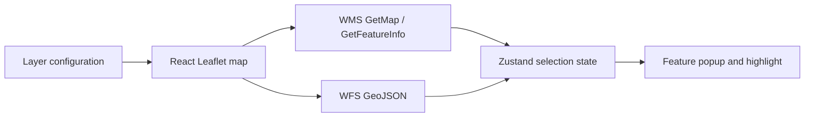

# PROGIS Map

Одностраничная геоинформационная система для просмотра и анализа картографических слоёв. Приложение объединяет Leaflet, OGC-сервисы WMS/WFS и интерактивное управление слоями в React-интерфейсе.

## Возможности

- отображение XYZ, WMS и WFS-слоёв;
- получение атрибутов объектов через GetFeatureInfo и GeoJSON;
- подсветка, центрирование и popup выбранного объекта;
- изменение порядка слоёв через drag-and-drop;
- просмотр и копирование атрибутов в JSON;
- уведомления об ошибках внешних геосервисов;
- конфигурация источников через JSON.

## Стек

- React 18 и TypeScript;
- Vite и Tailwind CSS;
- Leaflet и React Leaflet;
- Turf.js для пространственных операций;
- Zustand для состояния;
- dnd-kit для сортировки слоёв;
- Axios;
- Vitest и Testing Library.

## Архитектура



OGC-запросы формируются в `src/lib/ogc/`, карта и управление слоями находятся в `src/components/MapView/`, а выбранный объект хранится отдельно в Zustand store.

## Локальный запуск

Требуется Node.js 18 или новее.

```bash
npm install
npm run dev
```

## Проверки

```bash
npm run lint
npm test -- --run
npm run build
```

В репозитории есть компонентный smoke-test основного приложения. Для полноценного покрытия дополнительно нужны тесты OGC-запросов, обработки ошибок и взаимодействия со слоями.

## Конфигурация слоёв

Начальную конфигурацию можно взять из `src/config/layers.example.json`. Поддерживаемые типы:

- `xyz` — обычный tile layer;
- `wms` — растровый OGC-слой и GetFeatureInfo;
- `wfs` — векторные объекты GeoJSON.

Если публичный demo-сервис требует Basic Auth, приложение умеет читать:

```dotenv
VITE_WMS_USER=<public-demo-user>
VITE_WMS_PASS=<public-demo-password>
```

Переменные с префиксом `VITE_` попадают в browser bundle. Их нельзя использовать для production credentials или доступа к привилегированным геосервисам. В таком случае аутентификацию следует выполнять через server-side proxy.

## Структура

- `src/components/MapView/` — карта, слои и popup;
- `src/lib/ogc/` — WMS/WFS-запросы;
- `src/config/` — конфигурация источников;
- `src/state/` — состояние выбранного объекта;
- `src/types/ogc.ts` — типы OGC-данных.

Проект демонстрирует интеграцию внешних GIS API, работу с пространственными данными и построение интерактивного картографического интерфейса.
